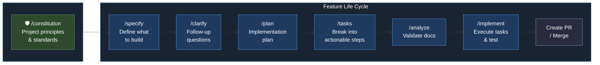
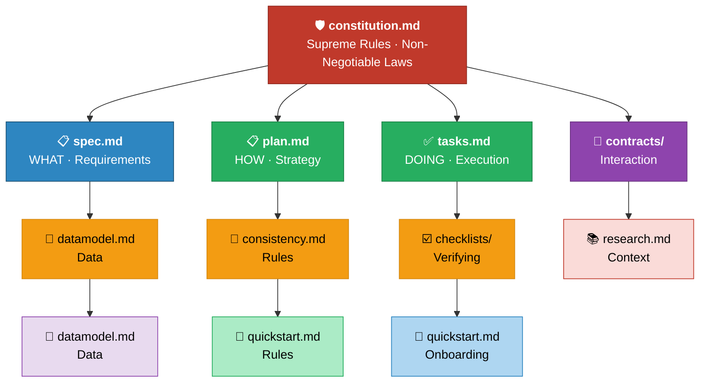

# Project Dd


> A software project built with Spec-Driven Development.

## Features

*Feature tracking will appear here once implementation begins.*

## Project Structure

| Directory | Purpose |
|-----------|--------|
| `specs/` | Specification files (SDD artifacts) |
| `.claude/` | Claude Code configuration |

## Getting Started

```bash
# See project documentation for setup instructions
```

## Development Process

This project uses **Spec-Driven Development (SDD)** — a methodology where structured specification files guide every stage of development, from requirements gathering through implementation and verification.

SDD wraps around existing delivery processes rather than replacing them. This approach minimizes disruption while maximizing value delivery and allows teams to maintain their current tools and workflows.

### Speckit Workflow

The feature lifecycle follows a structured pipeline from specification through implementation:



| Stage | Command | Purpose |
|-------|---------|---------|
| Define | `/specify` | Capture requirements — what to build, without technical detail |
| Clarify | `/clarify` | Follow-up questions to resolve ambiguity |
| Plan | `/plan` | Create an implementation strategy |
| Tasks | `/tasks` | Break the plan into actionable, trackable steps |
| Validate | `/analyze` | Verify consistency across all spec documents |
| Build | `/implement` | Execute tasks, write code, run tests |
| Ship | PR / Merge | Code review and integration |

### Spec Store

SDD files define the **WHAT**, **HOW**, **DOING**, **VERIFYING**, and **WHY** to build software safely and predictably with AI assistance:



| File | Role | Description |
|------|------|-------------|
| `constitution.md` | Governance | Supreme rules and non-negotiable project constraints |
| `spec.md` | Requirements | **What** to build — features, user stories, acceptance criteria |
| `plan.md` | Strategy | **How** to build it — architecture decisions, phasing |
| `tasks.md` | Execution | **Doing** — ordered, trackable implementation steps |
| `contracts/` | Interaction | API contracts, interface definitions |
| `datamodel.md` | Data | Entity schemas, relationships, validation rules |
| `consistency.md` | Rules | Cross-cutting constraints and invariants |
| `checklists/` | Verifying | Quality gates and verification criteria |

## Built With

Built with **[InfiniOS](https://github.com/infiniai-tech/infiniai-os-v2)** — an autonomous software development platform that uses Spec-Driven Development to build production-quality applications.

---

*Generated by [InfiniOS](https://github.com/infiniai-tech/infiniai-os-v2)*
